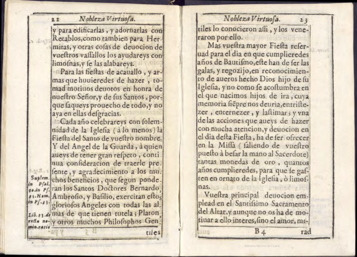
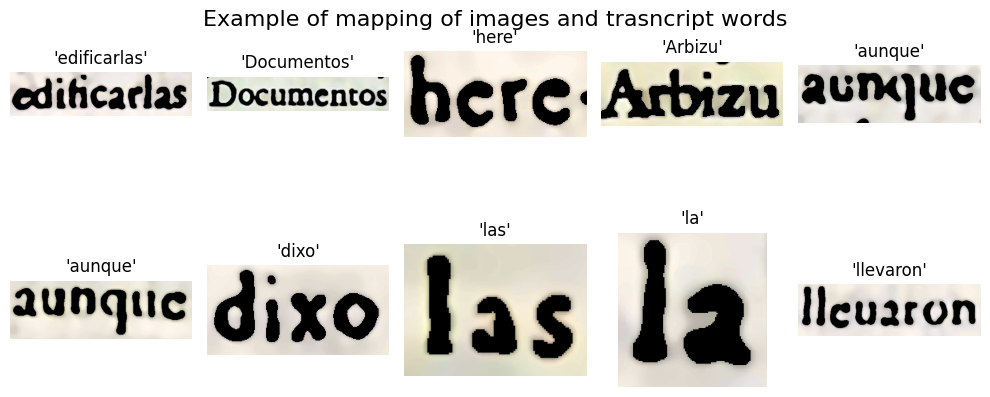
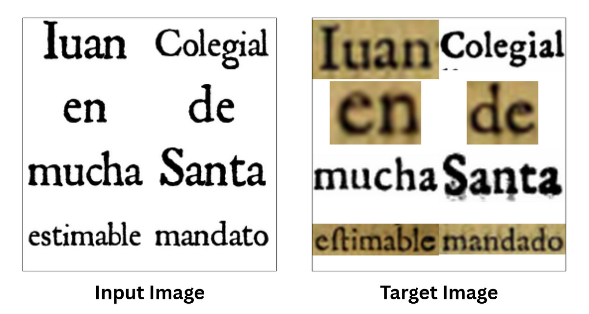
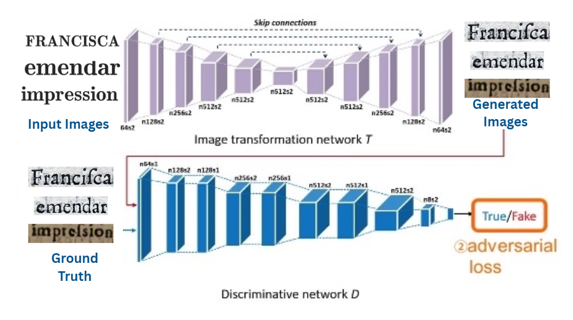
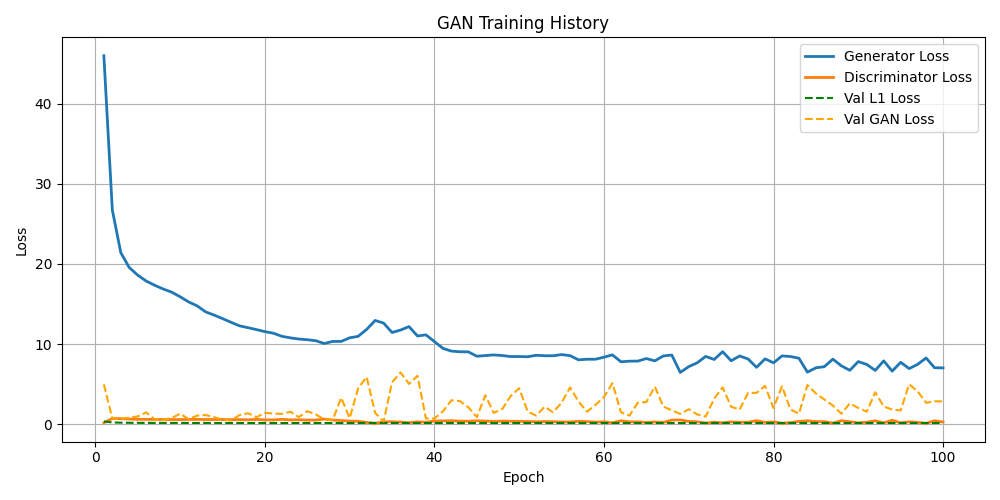
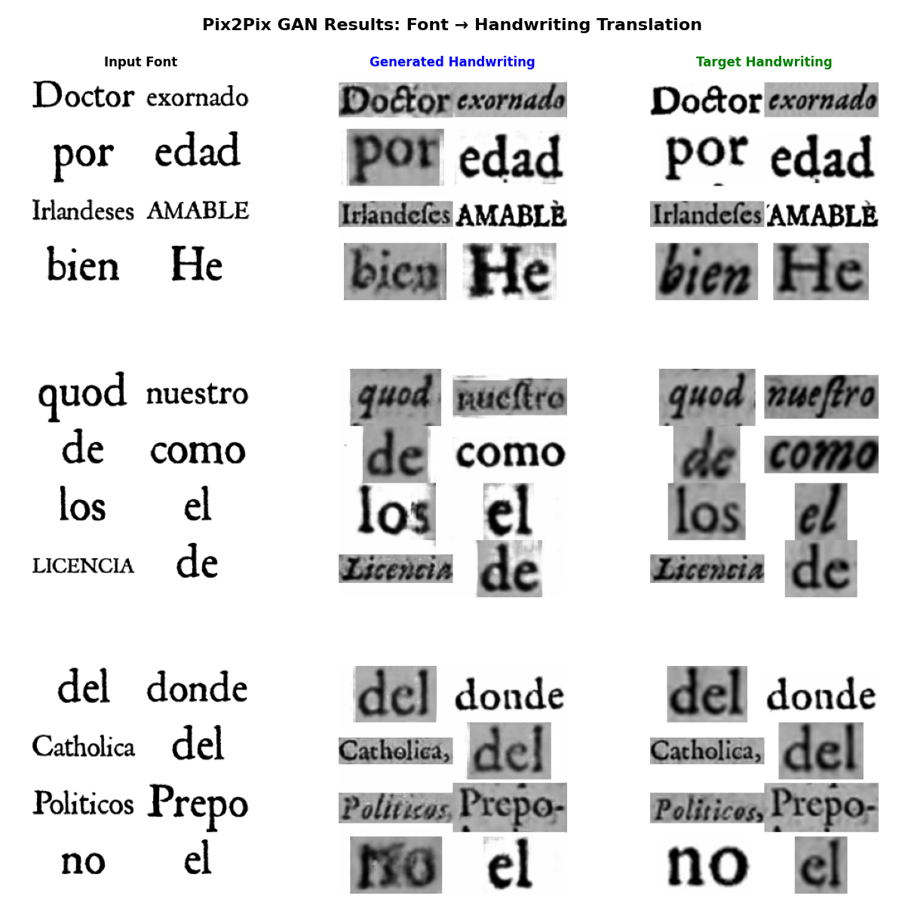
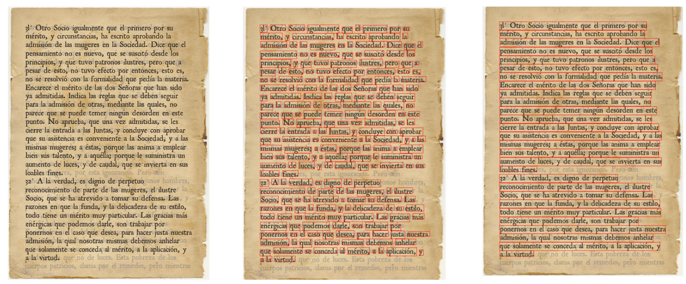

# Synthetic text generation with Generative Models

For Historical Manuscripts, limited availability of data a limiting factor in training OCR or Layout Detection models. This project propose a solution to this bottleneck by using a GAN architecture to generate synthetic renaissance style Image Data which can be used to improve OCR model performance on historical Spanish texts.This project is part of the HumanAI Foundation initiative and was developed during Google Summer of Code 2025.

## Table of Contents

- [Overview](#overview)  
- [Project Structure](#project-structure)  
- [Requirements](#Requirements)  
- [Data Generation Pipeline](#data-generation-pipeline)  
  - Splitting Pages  
  - Image Preprocessing  
  - Text Detection  
  - Aligning Detection with Transcript  
  - Dataset Creation  
  - Grid Construction  
- [Model Building & Training](#model-building--training)  
  - Generator & Discriminator  
  - Training Loop  
- [Inference & Synthetic Page Generation](#inference--synthetic-page-generation)  
- [Usage](#usage)  

---

## Overview

Historical OCR is challenged by scarce data and variable degradation in old manuscripts. This project:

1. Builds a **data‑generation pipeline** to split, enhance, detect, and align word images from scanned PDFs and transcripts.
2. Implements a **Pix2Pix‑style GAN** (U‑Net generator + PatchGAN discriminator) to translate clean synthetic text into realistic Renaissance‑era handwriting.
3. Provides a **procedural synthetic page generator** that simulates paper aging, ink bleed, and layout irregularities.

---

## Project Structure

```

.
├── experimentation.ipynb       # Jupyter notebook demonstrating end-to-end pipeline
├── data/                       # (not committed) raw PDFs and transcripts
├── outputs/                    # generated datasets, models, and figures
└── src/                        # core modules (imported in the notebook)
├── data_utils.py          # data-splitting, preprocessing, detection, mapping, dataset creation
└── model_utils.py         # GAN model classes and training/inference helpers

````

---

## Requirements

- Python 3.8+  
- [PyTorch](https://pytorch.org/)  
- torchvision  
- Pillow  
- numpy, pandas, matplotlib  
- CRAFT text‑detection model weights (download per instructions in `src/data_utils.py`)  

Downlaod the data and required model files from : [LINK](https://iitbhu365-my.sharepoint.com/:f:/g/personal/saarthak_gupta_mec22_iitbhu365_onmicrosoft_com/EtFan2TQidhNhTXXK45qTGwBAvyxOfpaJNxhSPWy16N0EA?e=fbdyuR)

Install with:

```bash
pip install torch torchvision pillow numpy pandas matplotlib
````

---

## Data Generation Pipeline

All functions below are implemented in **`src/data_utils.py`** and demonstrated in the notebook.

### 1. Splitting Pages

* **`copy_all_images(csv_file)`** / **`copy_all_transcripts(csv_file)`**
  Splits multi‑page PDFs into per‑page images and aligns each with its transcript.

  

### 2. Image Preprocessing

* **`analyze_image_sizes(...)`**, **`resize_and_pad(...)`**
* **`extract_and_process_all_regions(...)`**
  Skew correction, DPI adjustment, denoising, binarization, morphological operations.

  

### 3. Text Detection

* **`text_detection(image_path, craft_model)`**
  Uses CRAFT to find word‑level bounding boxes on each page.
  
### 4. Aligning Detection with Transcript

* **`mapping_bounding_boxes(...)`**
  Fine‑tuned PyTesseract + string similarity (threshold 0.8) to match each box to its correct transcript word.
  

### 5. Dataset Creation

* **`generate_text_image_dataset(...)`**
  Renders each matched word in RomanAntique font (64×128), stacks 8 word images into a 256×256 grid, cleans and saves \~4,800 paired samples.

### 6. Grid Construction

* **`plot_bounding_boxes(...)`**, **`create_grid_from_words(...)`**
  Utility functions to visualize detections and composite word grids for GAN input.



---

## Model Building & Training

All model definitions and training helpers live in **`src/model_utils.py`**.

### Generator & Discriminator

* **`class UNetGenerator(nn.Module)`**
  U‑Net with encoder/decoder and skip connections for image‑to‑image translation.
* **`class PatchDiscriminator(nn.Module)`**
  70×70 PatchGAN discriminator for local realism.

 
### Training Loop

* **`def train_pix2pix(csv_file, epochs=100, batch_size=32, lr=2e-4, save_dir="models")`**

  * **Generator loss:** BCE GAN loss + 100× L1 loss
  * **Discriminator loss:** 0.5 × (Loss\_real + Loss\_fake)
* **`def plot_gan_history(csv_path)`**, **`def visualize_pix2pix_results(...)`**
  Scripts to track losses and sample outputs.


---

## Inference & Synthetic Page Generation

* **`class GANInferencePipeline:`**

  * `load_generator(generator_path)`
  * `visualize_pix2pix_results(...)`
* **`class SyntheticPageGenerator:`**

  * `render_single_word(word) → Image`
  * `create_grid_from_words(words) → Image`
  * `preprocess_image(...)`, `postprocess_output(...)`


These classes let you generate new word samples and full synthetic pages.



---

## Usage

1. **Prepare data**
   Place your PDFs and transcripts under `data/raw/`, then run the “Data Generation” cells in `experimentation.ipynb`.

2. **Generate training set**
   Execute the notebook cells up through `generate_text_image_dataset(...)`.

3. **Train GAN**
   In the notebook (or via command line):

   ```python
   from src.model_utils import train_pix2pix
   train_pix2pix(
       csv_file="outputs/dataset/mapping.csv",
       epochs=100,
       batch_size=32,
       lr=2e-4,
       save_dir="outputs/models"
   )
   ```

4. **Visualize results**

   ```python
   from src.model_utils import visualize_pix2pix_results
   visualize_pix2pix_results(
       "outputs/models/generator.pth",
       dataloader, 
       num_samples=5
   )
   ```

5. **Generate synthetic pages**

   ```python
   from src.model_utils import SyntheticPageGenerator
   spg = SyntheticPageGenerator()
   page_img = spg.create_synthetic_page_from_text("To be, or not to be…")
   page_img.save("outputs/pages/page1.png")
   ```

---
